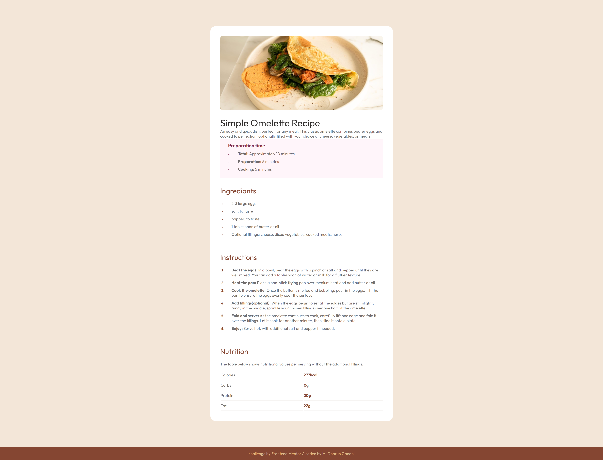
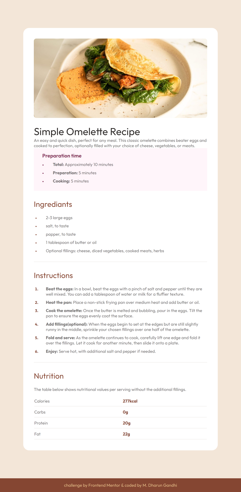

# Frontend Mentor - Recipe page solution

This is a solution to the [Recipe page challenge on Frontend Mentor](https://www.frontendmentor.io/challenges/recipe-page-KiTsR8QQKm). Frontend Mentor challenges help you improve your coding skills by building realistic projects. 

## Table of contents

- [Overview](#overview)
  - [The challenge](#the-challenge)
  - [Screenshot](#screenshot)
  - [Links](#links)
- [My process](#my-process)
  - [Built with](#built-with)
- [Author](#author)

## Overview

### Screenshot

### Links

- Solution URL: [Github Repo](https://github.com/Dharungandhy28/frontend-recipe-page)
- Live Site URL: [Site URL](https://profound-cupcake-97d19d.netlify.app/)

## My process

### Built with

- Semantic HTML5 markup
- CSS custom properties
- Flexbox
- Mobile-first workflow

## Author

- Github - [Dharun Gandhi](https://github.com/Dharungandhy28)
- Frontend Mentor - [@Dharungandhy28](https://www.frontendmentor.io/profile/Dharungandhy28)

